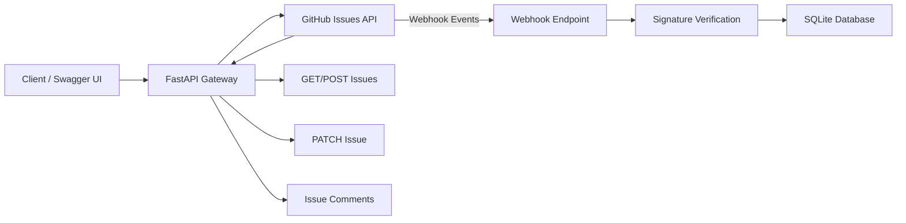

# GitHub Issues Gateway

A FastAPI-based gateway service for managing GitHub Issues through a REST API. The application integrates with the GitHub Issues API, supports issue management operations, receives GitHub webhooks, verifies webhook signatures, and stores webhook events in a SQLite database.

---

## Architecture Diagram


## Features

### Issues API

- Create GitHub issues
- List repository issues
- Update existing issues
- Close issues
- Add comments to issues

### Webhook Processing

- Receive GitHub webhook events
- Verify HMAC SHA-256 webhook signatures
- Process issue-related events
- Store webhook event metadata in SQLite

### Persistence

Stores the following webhook information:

- Delivery ID
- Event Type
- Action
- Issue Number
- Timestamp

### Testing

- Unit tests
- Integration tests
- Validation tests
- Webhook signature verification tests

---

## Project Structure

```text
project/
│
├── app/
│   ├── services/
│   ├── db.py
│   ├── github_client.py
│   ├── main.py
│   └── models.py
│
├── tests/
│   ├── integration/
│   │   └── test_github_api.py
│   │
│   └── unit/
│       ├── test_pagination.py
│       ├── test_validation_and_errors.py
│       └── test_webhook_signature.py
│
├── .env
├── .gitignore
├── check_db.py
├── Dockerfile
├── events.db
├── generate_openapi.py
├── Makefile
├── openapi.yaml
├── pytest.ini
├── README.md
└── requirements.txt
```

---

## Requirements

- Python 3.11+
- GitHub Personal Access Token
- GitHub Repository with Issues enabled

---

## Installation

Clone the repository:

```bash
git clone <repository-url>
cd project
```

Create and activate a virtual environment:

### Windows

```bash
python -m venv env
env\Scripts\activate
```

### macOS/Linux

```bash
python3 -m venv env
source env/bin/activate
```

Install dependencies:

```bash
pip install -r requirements.txt
```

---

## Environment Variables

Create a `.env` file in the project root.

```env
GITHUB_TOKEN=your_github_token
GITHUB_OWNER=your_github_username
GITHUB_REPO=your_repository_name
WEBHOOK_SECRET=my-super-secret
```

---

## Running the Application

Start the FastAPI server:

```bash
uvicorn app.main:app --reload
```

Server:

```text
http://localhost:8000
```

Swagger UI:

```text
http://localhost:8000/docs
```

OpenAPI JSON:

```text
http://localhost:8000/openapi.json
```

---

## API Endpoints

### Health Check

```http
GET /healthz
```

### List Issues

```http
GET /issues
```

### Create Issue

```http
POST /issues
```

Example:

```json
{
  "title": "New Issue",
  "body": "Issue description"
}
```

### Update Issue

```http
PATCH /issues/{number}
```

Example:

```json
{
  "title": "Updated Title",
  "state": "closed"
}
```

### Add Comment

```http
POST /issues/{number}/comments
```

Example:

```json
{
  "body": "This is a comment"
}
```

### GitHub Webhook

```http
POST /webhook
```

Receives GitHub webhook events and stores them in SQLite after signature verification.

---

## Database

SQLite database:

```text
events.db
```

Table:

```text
webhook_events
```

Columns:

| Column | Description |
|----------|------------|
| id | Primary key |
| delivery_id | GitHub delivery identifier |
| event_type | GitHub event type |
| action | Event action |
| issue_number | Related issue number |
| timestamp | Event timestamp |

---

## Testing

Run all tests:

```bash
pytest
```

Run only unit tests:

```bash
pytest tests/unit
```

Run only integration tests:

```bash
pytest tests/integration
```

---

## Webhook Verification

Webhook signatures are validated using:

```text
X-Hub-Signature-256
```

Algorithm:

```text
HMAC SHA-256
```

Requests with invalid signatures are rejected with:

```http
401 Unauthorized
```

---

## Sample Verified Events

The application successfully stores:

- issues.opened
- issues.closed
- issue_comment.created

Webhook deliveries are persisted in SQLite for auditing and tracking.

---

## Author

Ayushi Surange

CMPE 272 – Enterprise Software Platforms
